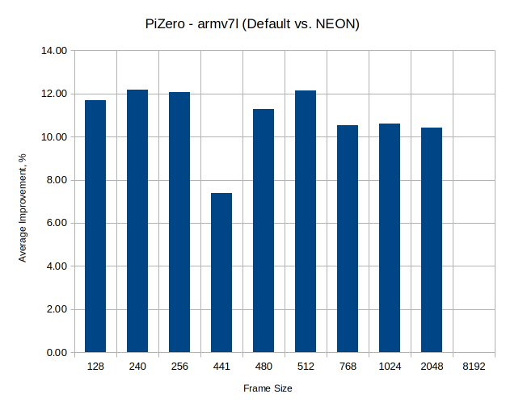
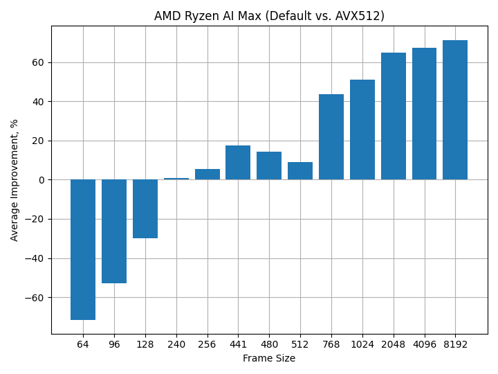

# NEON Optimized DSP Functions for Ardour

This project provides ARM NEON–optimized implementations of several common
digital signal processing (DSP) routines in Ardour. The optimized functions are
designed to work on ARM AArch64 systems (such as the Apple M1) and include
microbenchmarking and unit tests for verification and performance comparison
against default (unoptimized) implementations.

## Results from M3 Pro

## Results from Raspberry Pi Zero 2

## Results from Raspberry Pi 2 (armv7l)

*8192 frame size did not complete in time

## Results from AMD Ryzen AI Max (AVX512)

